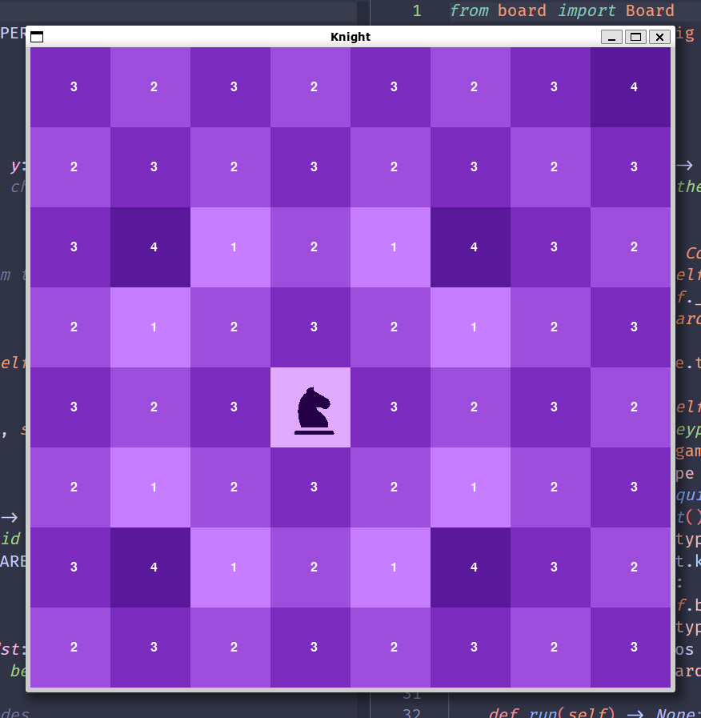

# Knight ♘

This is a simple experiment made with Python that uses Pygame to see the number of moves it takes a knight to get around a chessboard.



## Installation
Since this is just an experiment the best way to try it is to clone this repository and inside the repository's root folder run:
```bash
python knight.py

# or

python3 knight.py
```

## How to use
For the moment the only thing you can do is to press `r` to reset the knight position and with it the rest of the chessboard.